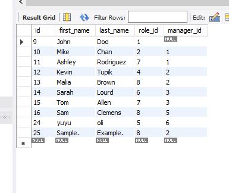

# Employee Tracker

 

## Description
Keep track of employee's records such as employee id's, roles, salaries and managers.

## Table of Contents
* [Description](#description)
* [Installation](#installation)
* [Usage](#usage)
* [Contribution](#contribution)
* [Test](#test)
* [Links](#links)
* [Questions](#questions)
* [Screenshot](#screenshot)
* [License](#license)

## Installation
Run server.js in your terminal and select if you would like view, update,or add employees/roles.

## Usage
You can use mysql work bench to view tables and edit tables. You can also edit tables by selecting what you would like to do to help keep track of employees.

## Contribution
N/A

## Test
N/A

## Questions
You can reach me with questions at Email djanetod@hotmail.com.
GitHub: OliveraDiaz

## Links
Screencastify: https://watch.screencastify.com/v/okW466puWWVy4isYJd80 Github repo: https://github.com/OliveraDiaz/EmployeeTracker.git

## Screenshot

